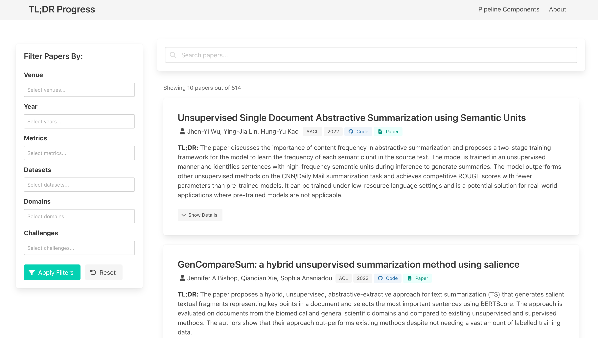
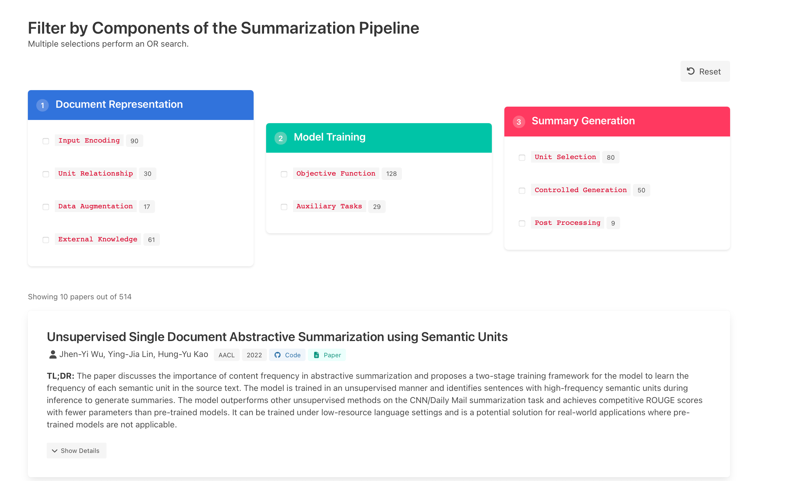
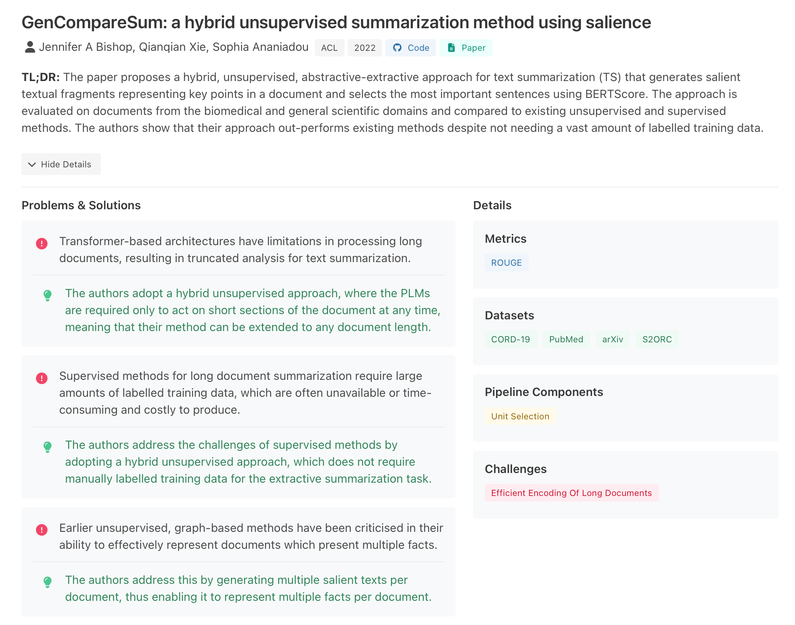

# TL;DR Progress: Multi-faceted Literature Exploration in Text Summarization. [[Demo](https://www.tldr-progress.de/)] [[Paper](https://arxiv.org/abs/2402.06913)]

TL;DR Progress is an interactive web application for exploring the landscape of text summarization research. It provides a curated database of papers annotated with different aspects of text summarization such as datasets, evaluation metrics, pipeline components and research challenges. 

## Features

- 🔍 Search papers by title, abstract, or TL;DR summary
- 🏷️ Filter papers by venue, year, metrics, and datasets etc.
- 🧩 Explore papers by pipeline components (Input Encoding, Unit Relationship, etc.)
- 📊 Interactive visualizations of research trends
- 📑 TL;DR summaries for quick paper understanding


## Screenshots







## Installation

1. Clone the repository:
   ```bash
   git clone https://github.com/your-username/eacl24-tldr-progress.git
   cd eacl24-tldr-progress
   ```

2. Create and activate a virtual environment:
   ```bash
   python -m venv .venv
   source .venv/bin/activate  # On Windows, use: .venv\Scripts\activate
   ```

3. Install dependencies:
   ```bash
   pip install -r requirements.txt
   ```

## Running the Application

1. Start the FastAPI server:
   ```bash
   uvicorn app.main:app --reload
   ```

2. Open your browser and navigate to:
   ```
   http://localhost:8000
   ```

The application will load with the full database of papers and all filtering capabilities enabled.


## Development

- The application is built with FastAPI for the backend and uses SQLite for the database
- Frontend uses Bulma CSS framework and HTMX for dynamic updates
- All templates are in the `app/templates` directory
- Static files (CSS, JS) are in the `app/static` directory
- Database and models are in the `app/database` directory

